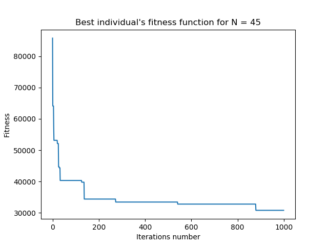

# Linear-quadratic-problem

#### Project goals

The purpose of the program is to find the best solution to the linear-quadratic problem with the use of evolutionary programming.

#### Results 

The program's results after 1000 iterations and with the value of parameter N set for 45 are shown below.

